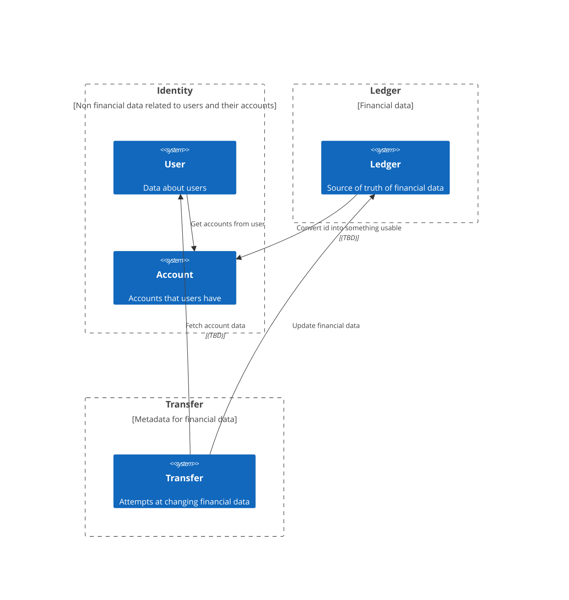

# Ledger system



## Secrets Management

Ideally credentials are never stored in version control, so should adopt same practice as .env and .env.example.
Credentials can be set on the machine or in an external vault.

## Kubernetes
Commands below will allow you to setup and run.
Use kubernetes over just deploying apps manually because if an app crashes or duplicates need to be spun up, it will require lots of manual intervention whereas kubernetes will rerun the app if it crashes and if the number of replicas need to change automatically, this can be done (so during peak periods, more replicas can be spun up).

**Note:** Setup secrets before applying:
```bash
# See SECRETS_SETUP.md for proper secret creation
kubectl create secret generic postgres-secret \
  --from-literal=POSTGRES_USER=<user> \
  --from-literal=POSTGRES_PASSWORD=<password> \
  --from-literal=POSTGRES_DB=<db_name>

kubectl apply -f ./k8s/
kubectl port-forward svc/go-app-service 8080:80
```

## Helm
Will need to wait until database is up and live before attempting to make any queries.
Helm is preferred over just using kubernetes because it can be used across environments instead of copying and pasting YAML across local, demo and live.
```bash
helm install go-app-service ./lambda-system-prac-workflow
kubectl port-forward svc/go-app-service-lambda-system-prac-workflow 8080:8080
```
