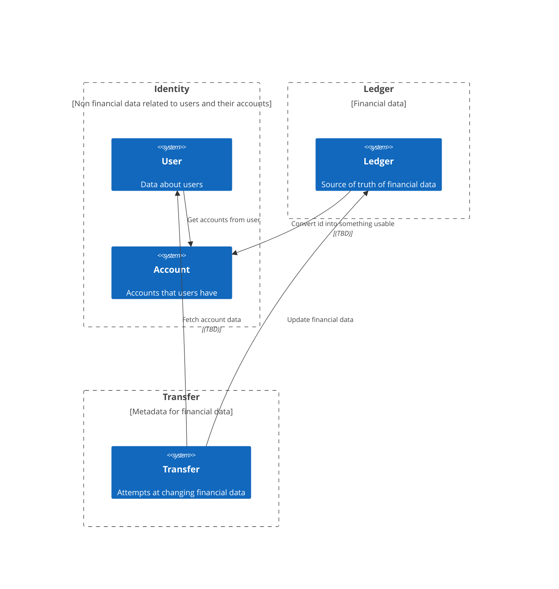

# Ledger system

```mermaid
C4Context
    Boundary(b0, "Identity", "Non financial data related to users and their accounts") {
        System(SystemA, "User", "Data about users")
        System(SystemB, "Account", "Accounts that users have")
    }
    
    Boundary(b1, "Ledger", "Financial data") {
        System(SystemC, "Ledger", "Source of truth of financial data")
    }

    Boundary(b2, "Transfer", "Metadata for financial data") {
        System(SystemD, "Transfer", "Attempts at changing financial data")
    }

    Rel(SystemA, SystemB, "Get accounts from user", "")
    Rel(SystemD, SystemA, "Fetch account data", "(TBD)")
    Rel(SystemD, SystemC, "Update financial data", "")
    Rel(SystemC, SystemB, "Convert id into something usable", "(TBD)")
```
